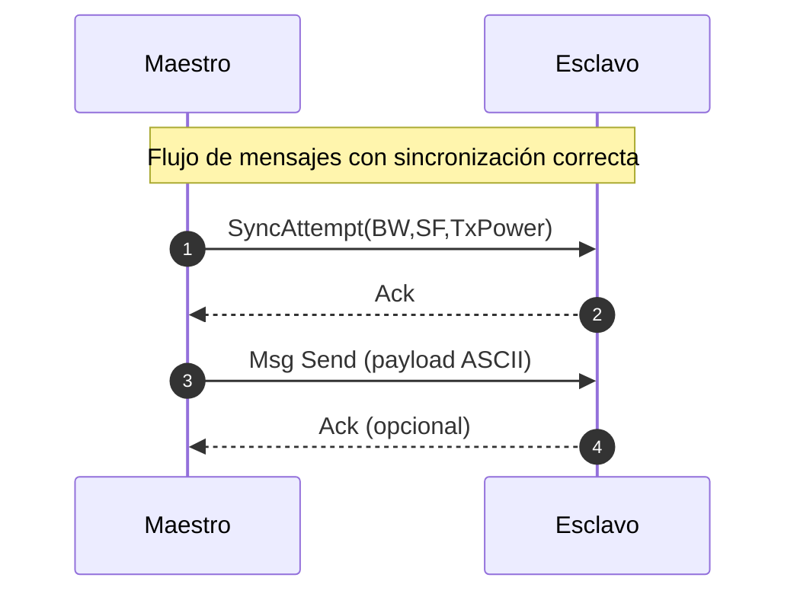
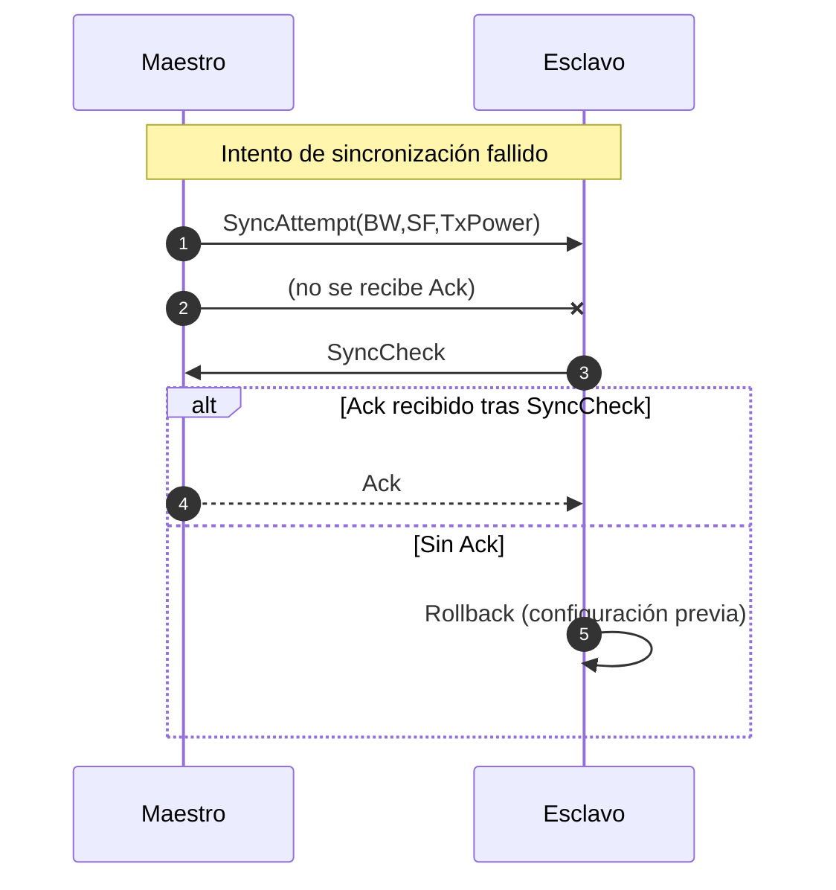

# Nuevo Protocolo LoRa

> **Transcripción y normalización** a partir de las tres páginas manuscritas que compartiste. He mantenido los términos tal como aparecen (Ack, SyncAttempt, SyncCheck, FORBIDDEN, etc.) y he organizado todo para que lo puedas incluir en tu informe.

---

## 1. Parámetros generales
- **Tamaño máximo de mensaje en LoRa (SF12)**: 51 bytes ⇒ **usamos 50 bytes** de carga útil para el protocolo.

---

## 2. Formato de la trama (capa de protocolo sobre LoRa)
La carga útil LoRa encapsula el siguiente encabezado "ligero" y los mensajes del protocolo.

```
Byte 0   Byte 1        Byte 2        Byte 3..N
+-------+-------------+-------------+---------------------------
| Dst   | LocalAddr   | MsgSize     | Payload (mensajes)       |
+-------+-------------+-------------+---------------------------
```
- **Dst**: dirección de destino (1 byte)
- **LocalAddr**: dirección local/origen (1 byte)
- **MsgSize**: longitud total del `Payload` (1 byte)
- **Payload**: uno de los mensajes del protocolo definidos abajo

> Nota: En los bocetos aparece “Destination / local address” junto al encabezado. He separado explícitamente **Dst** y **LocalAddr** para que quede inequívoco en el informe.

---

## 3. Mensajes del protocolo (dentro de `Payload`)
### 3.1 Cabecera mínima de mensaje
```
Offset 0 (dentro de Payload)
Bit:   7   6 5 4 3 2 1   0
      +---+-------------+---+
      | X |  Z Z Z Z Z  | Y |
      +---+-------------+---+
```
- **X** (1 bit): **rol de origen** → `1 = Master`, `0 = Slave`.
- **Z** (6 bits): **reservado** (para flags futuros).
- **Y** (1 bit): **LSB de tipo** o flag auxiliar (según mensaje).

El **tipo de mensaje** se expresa con **YY (2 bits)**:

| YY | Tipo           | Payload adicional |
|----|----------------|-------------------|
| 00 | **ACK**        | *No payload*      |
| 01 | **FORBIDDEN**  | *No payload*      |
| 10 | **Message Send** | ASCII            |
| 11 | **SyncCheck**  | *No payload*      |

> En el manuscrito aparece explícitamente: `YY: 00→ACK, 01→FORBIDDEN, 10→Message Send, 11→SyncChk`.

### 3.2 Message Send
- Patrón ilustrativo visto en el boceto: `X0000010` (X=origen, `10` = tipo *Message Send*).
- **Cuerpo**: bytes ASCII `YYYYY…` (texto de aplicación), hasta completar `MsgSize`.

### 3.3 SyncAttempt (solo **Master**)
Mensaje de intento de sincronización con parámetros de radio compartidos:
```
+----------------+----------------+----------------+
| BandWidth (x)  | SpreadingFactor (y) | TxPower (z) |
+----------------+----------------+----------------+
```
- En los dibujos se marcan como **x = BandWidth**, **y = SpreadingFactor**, **z = TxPower**. 
- Si no tienes una asignación de bits cerrada aún, puedes tratarlos como **1 byte** cada uno (recomendación para la primera versión del informe); ajusta después si necesitas granularidad por bits.

---

## 4. Flujos de mensajes (secuencias)
### 4.1 Flujo normal (sincronización satisfactoria)


### 4.2 SyncAttempt no satisfactorio


### 4.3 Flujo **Sync Restart** (cada 2 min)
> Texto del manuscrito (normalizado): “**Cada 2 min** sin recibir mensajes, las placas comprueban su estado de sincronización con **SyncCheck**. Si esto no funciona, ambos vuelven a un estado de **fallback** con un **SF** y **BW** conocidos por ambos. A partir de aquí el **maestro** vuelve a realizar la sincronización.”

```mermaid
flowchart TD
    T0[Inicio] --> T1{¿Han pasado 2 min sin mensajes?}
    T1 -- No --> T0
    T1 -- Sí --> T2[Ambos ejecutan <br/>SyncCheck]
    T2 --> T3{¿Sincronía correcta?}
    T3 -- Sí --> T0
    T3 -- No --> T4[Fallback a SF/BW conocidos]
    T4 --> T5[Maestro envía SyncAttempt]
    T5 --> T6{¿Recibe Ack?}
    T6 -- Sí --> T0
    T6 -- No --> T7[Reintentar / Diagnóstico <br/>(Rollback si procede)]
    T7 --> T4
```

---

## 5. Criterios de aceptación
- **Ack** recibido tras `SyncAttempt` ⇒ enlaces sincronizados.
- En `Message Send`, tamaño ≤ 50 bytes y texto ASCII válido.
- Tras **Sync Restart**, ambos nodos quedan en el par **(SF,BW)** acordado y reanudan `Message Send`.

## 6. Observaciones
- He conservado los nombres exactos (*Ack*, *SyncAttempt*, *SyncCheck*, *FORBIDDEN*) y el **mapa de tipos YY** según tus notas.
- Si tienes el **detalle exacto de bits** para x/y/z en `SyncAttempt`, lo incorporo y actualizo los diagramas.
